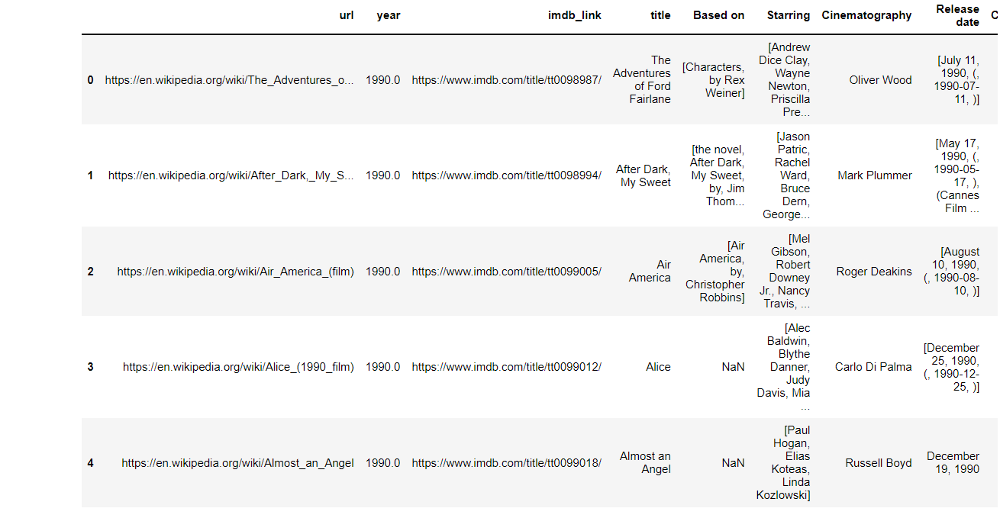
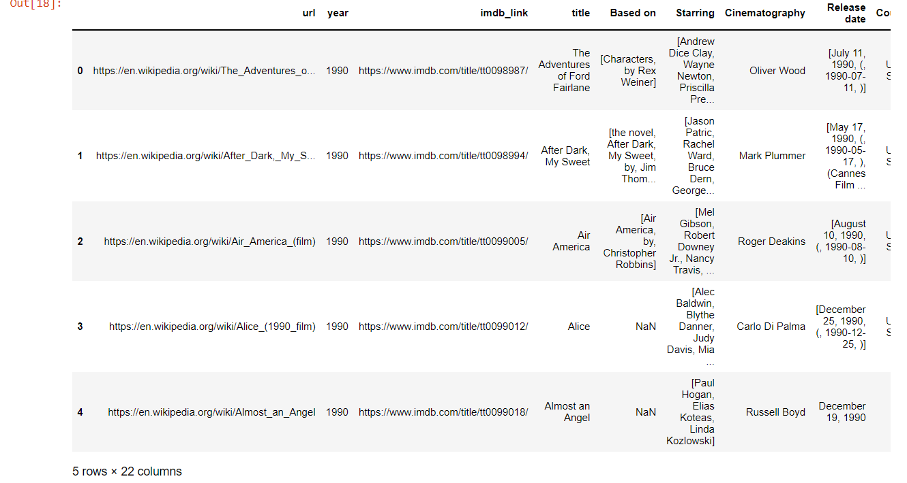
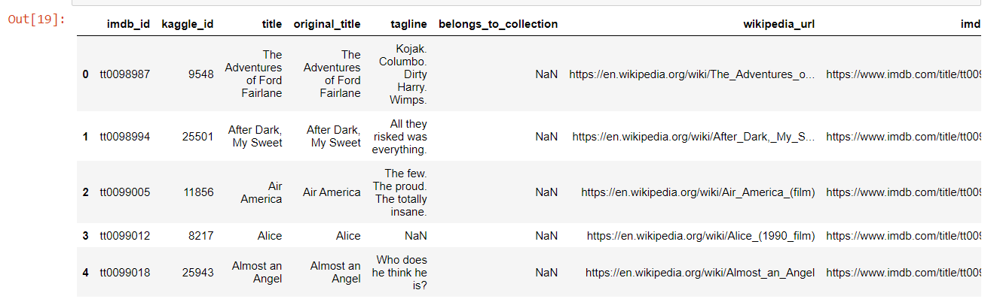
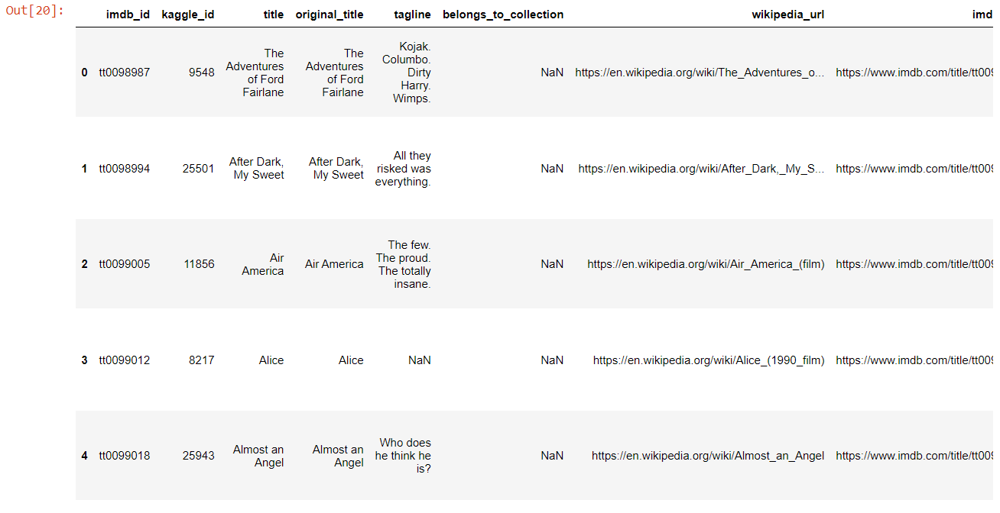
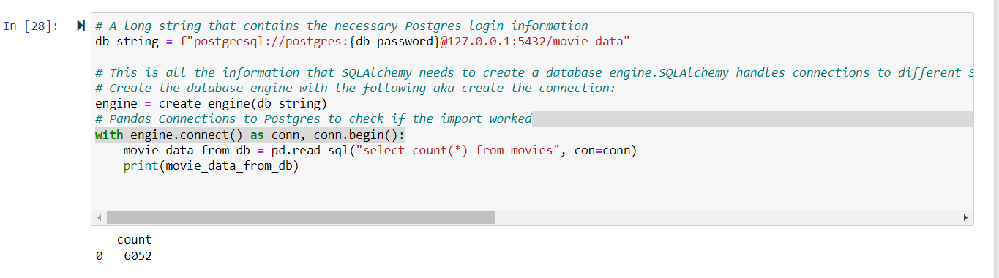
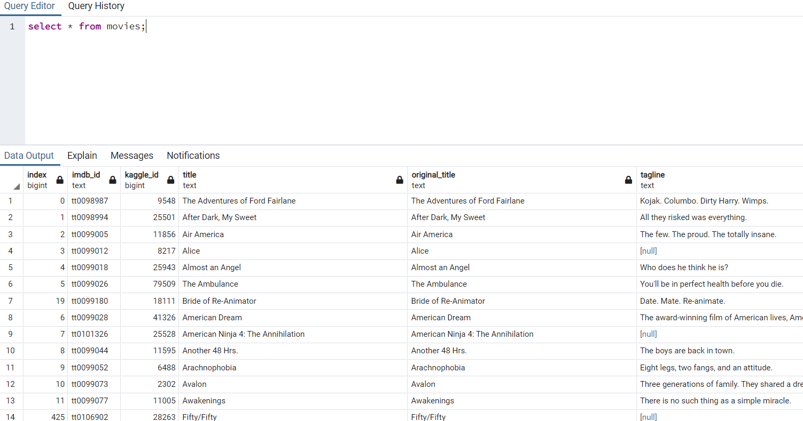
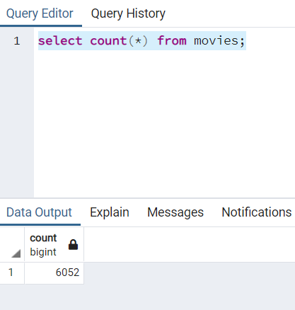
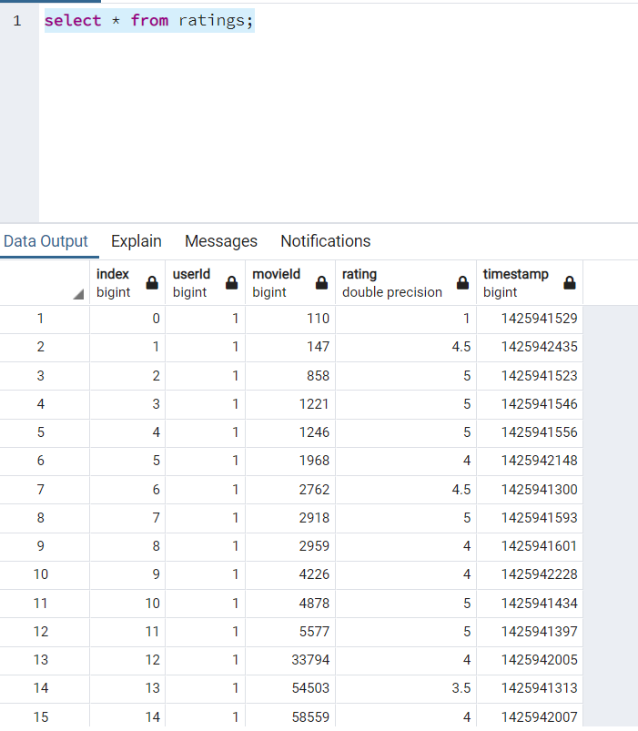
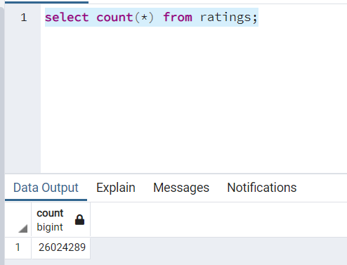

# Movies-ETL
Module 8

# Objective
 Task is to create an automated pipeline that takes in new data, applies transformations and loads into postgres tables. Module 9 code will be refactored to create a function that takes in the three files—Wikipedia data, Kaggle metadata, and the MovieLens rating data. In addition ETL process will be applied by adding the data to   PostgreSQL database.

## Deliverable 1: Write an ETL Function to Read Three Data Files

   Deliverable involves reading from three data files and creating three separate DataFrames.

## Deliverable 2: Extract and Transform the Wikipedia Data
 
  Extraction and transformed Wikipedia data is merged with the kaggle metadata in this deliverable. Try-execpt block has been leveraged to catch errors while extracting the IMBb IDs using a regular expression string and dropping duplicates.

## Deliverable 3: Extract and Transform the Kaggle data

  Extraction and transformed kaggle metadata along with MovieLens rating data is then converted into separated DataFrames via this deliverable 3. In addition kaggle metadata DataFrame is merged with Wikipedia movies DataFrame to create movies_df DataFrame.Final  movies_with_ratings_df DataFrame is created by merging MovieLens rating data and movies_df DataFrames. 

## Deliverable 4: Create the Movie Database

 This module involves addition of data from movies_df and MovieLens rating csv to PostgreSQL tables movies and ratings.

